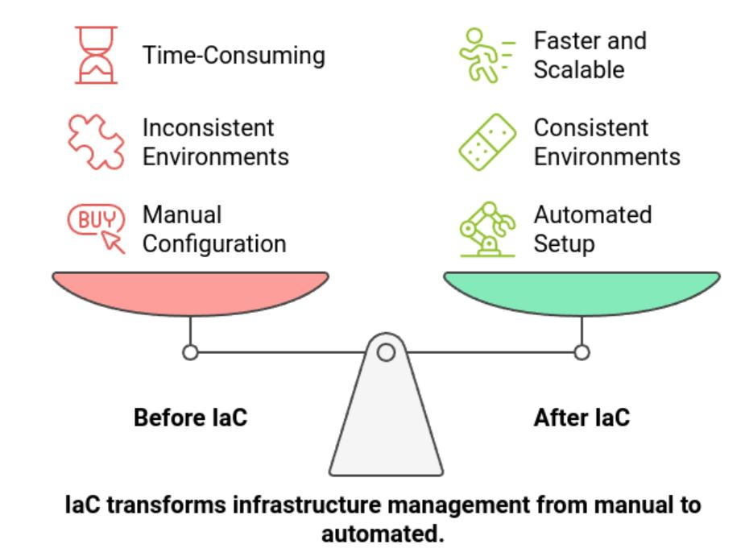
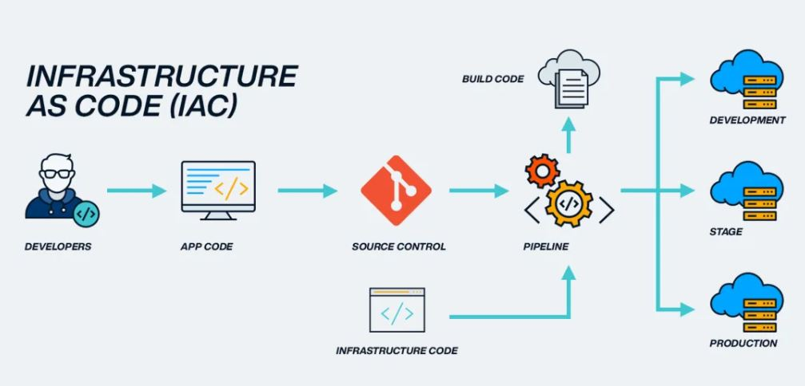

# What is IAC ?

IAC stands for Infrastructure as Code. It is the practice of managing and provisioning computing infrastructure (like servers, networks, databases, etc.) 
using machine-readable configuration files, rather than through manual processes or interactive tools (e.g., clicking in a UI).

  

**Key Principles and Characteristics of IaC:**

  

|Principle|Characterstics|
|:-|:-|
|**Code-driven:** |Your infrastructure is described in text files (e.g., using YAML, JSON, HCL, Python). These files are version-controlled, just like application code, typically in systems like Git. This provides a single source of truth for your infrastructure.|
|**Automation:**| IaC tools interpret this code and automate the process of provisioning and managing the infrastructure.This eliminates manual configuration, which is prone to human error and inconsistency.|
|**Consistency and Repeatability:**| Because the infrastructure is defined by code, applying that code always results in the same environment. This ensures consistency across different environments (development, testing, production) and eliminates "configuration drift" (where environments gradually diverge due to ad-hoc manual changes).|
|**Idempotence:**| IaC tools are often idempotent, meaning that applying the same configuration multiple times will always result in the same desired state, without causing unintended side effects. If the infrastructure is already in the desired state, the tool will make no changes.|
|**Version Control and Collaboration:**| Storing infrastructure code in version control systems (like Git) enables:|
|**Tracking Changes:**| A complete history of who changed what, when, and why.|
|**Rollbacks:**| The ability to easily revert to a previous, stable configuration if an issue arises.|
|**Collaboration:**| Multiple team members can work on the infrastructure definition simultaneously, with standard code review processes (e.g., Pull Requests).|

**Declarative vs. Imperative:**
* Declarative IaC (What): You describe the desired end state of your infrastructure, and the IaC tool figures out the steps to get there.
  Examples: Terraform, AWS CloudFormation, Azure Resource Manager. This is generally preferred for infrastructure provisioning.
* Imperative IaC (How): You define the specific steps or commands that need to be executed in a particular order to achieve the desired state.
  Examples: Shell scripts, Ansible Playbooks (though Ansible can also be used declaratively for configuration management). This is more common for configuration management or orchestration.
