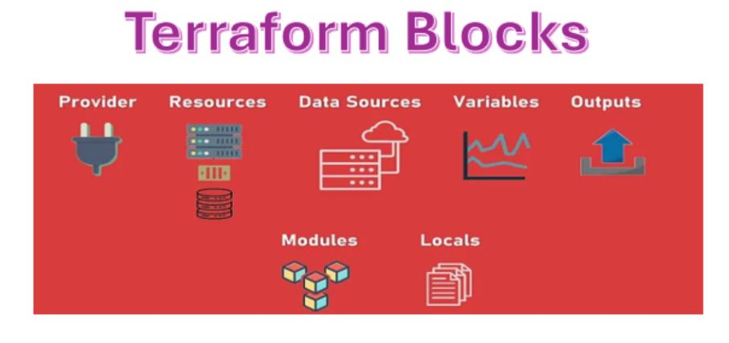

# 3. Understand Terraform basics:

To get started with Terraform, it's important to grasp the core components and how they work together. Terraform is a powerful Infrastructure as Code (IaC) tool that enables you to define, provision, and manage infrastructure using simple configuration files.

## 3(a). Install and version Terraform providers:

Installing Terraform is a straightforward process, and HashiCorp (the creators of Terraform) provides excellent official instructions. Here's a summary of the most common methods for different operating systems:

#### General Recommendations:

* **Always download from the official HashiCorp website:** https://developer.hashicorp.com/terraform/install This ensures you get legitimate and up-to-date binaries.
* **Verify the installation:** After following the steps, always run terraform -v or terraform version in your terminal to confirm it's installed correctly and shows the version number.


**Installation Method in Linux Operating System:**

For RHEL/CentOS/Fedora (using yum or dnf):

1. Install yum-utils (or dnf-plugins-core for Fedora):
```
sudo yum install -y yum-utils # For RHEL/CentOS/Amazon Linux
# OR
sudo dnf install -y dnf-plugins-core # For Fedora
```

2. Add the official HashiCorp Linux repository:
```
sudo yum-config-manager --add-repo https://rpm.releases.hashicorp.com/RHEL/hashicorp.repo # For RHEL/CentOS/Amazon Linux
# OR
sudo dnf config-manager --add-repo https://rpm.releases.hashicorp.com/fedora/hashicorp.repo # For Fedora
```

3. Install Terraform:
```
sudo yum -y install terraform # For RHEL/CentOS/Amazon Linux
# OR
sudo dnf -y install terraform # For Fedora
```

4. Verify installation:
```
terraform version
```

### Key Concepts:
<p align="center">
  
</p>

||Description|
|:-|:-|
|**Configuration Files**|Written in HashiCorp Configuration Language (HCL) or JSON, describing the desired state of infrastructure.|
|**Providers** |Plugins that enable Terraform to interact with various cloud platforms (AWS, Azure, GCP, etc.) and services.|
|**Resources**|The individual components you create, manage, and modify (like EC2 instances, S3 buckets, etc.).|
|**State**|Terraform keeps track of your infrastructure's current state in a state file, enabling it to determine what changes are needed.|
|**Modules**|Reusable packages of Terraform configuration that can be shared and organized.|
|**Locals**|locals (or "local values") are a powerful feature that allows you to define named expressions within your configuration. They act like temporary, internal variables that help you make your Terraform code more readable, maintainable, DRY.|
|**Variables** |Terraform variables are fundamental to writing flexible, reusable, and maintainable infrastructure as code. They allow you to define parameters for your configurations that can be customized without altering the underlying HCL (HashiCorp Configuration Language) code.|
|**Outputs** |Terraform outputs are a way to extract and display specific values from your Terraform configuration after it has been applied. They act like return values for your infrastructure, making it easy to access important information about the resources you've provisioned.|         - 

### Terraform Configuration Model:

Terraform's configuration model is at the heart of how it manages infrastructure as code. It's designed to be declarative, meaning you describe the desired state of your infrastructure, and Terraform figures out the steps to get there

Here's a breakdown of the key components and concepts in the Terraform configuration model:

1. HashiCorp Configuration Language (HCL):
2. Blocks:
3. Key Configuration Blocks:
   - provider block:
   - resource block
   - variable block:
   - output block:
   - data block (Data Sources):
   - locals block (Local Values):
4.  Modules:
5.  State Management (.tfstate file):
6.  Execution Workflow:
### Terraform Block:

The terraform block in a Terraform configuration file is a top-level block that configures settings related to Terraform itself, rather than any specific cloud provider or resource. It tells Terraform how to behave when running, including:

### What the terraform block is used for:

|| Description|
|:----|-----|
|**Specifying required Terraform version**| Ensures the configuration only runs with compatible versions.|
|**Declaring required providers** | Tells Terraform what providers to use (like AWS, Azure, GCP) and their versions.|
|**Configuring the backend** | Defines where Terraform stores its state files (like local file system, S3, etc.).|
|**Enabling experimental features (optional)**| For preview or upcoming features in Terraform.|

Example: 
```
terraform {
  required_version = ">= 1.3.0"

  required_providers {
    aws = {
      source  = "hashicorp/aws"
      version = "~> 5.0"
    }
  }

  backend "s3" {
    bucket         = "my-terraform-state-bucket"
    key            = "prod/terraform.tfstate"
    region         = "us-west-2"
    encrypt        = true
    dynamodb_table = "terraform-locks"
  }
}
```

### **Resource Block**:

A Terraform resource block is the core component of a Terraform configuration. It's how you tell Terraform what infrastructure objects you want to create, manage, and update.

##### Each resource block describes one or more infrastructure objects, such as:

* **AWS:** An EC2 instance, an S3 bucket, a VPC, an RDS database, a security group.
* **Azure:** A Virtual Machine, a Resource Group, a Storage Account, a Virtual Network.
* **Google Cloud:** A Compute Engine instance, a Cloud Storage bucket, a VPC network.
* **Kubernetes:** A Deployment, a Service, a Pod.
* **Other APIs:** A user in GitHub, a DNS record in Cloudflare, an entry in a custom API.


#### Structure of a resource Block:


**Syntax:**
```
resource "<PROVIDER_NAME>_<TYPE>" "<LOCAL_NAME>" {
  # Argument 1 = Value 1
  # Argument 2 = Value 2
  # ...
  # Nested blocks, if any
}
```
Let's break down each part:

1. **resource keyword:** This keyword signifies that you are defining an infrastructure resource.

2. **<PROVIDER_NAME>_<TYPE> (Resource Type)**:
   * This is a string that uniquely identifies the type of resource being managed.
   * It's composed of two parts, separated by an underscore:
     - **PROVIDER_NAME:** The name of the Terraform provider responsible for managing this resource (e.g., aws, azurerm, google, kubernetes).
     - **TYPE:** The specific type of resource within that provider (e.g., instance, s3_bucket, virtual_machine, vpc).
 **Examples:** aws_instance, azurerm_resource_group, google_compute_instance.

3. **<LOCAL_NAME> (Local Name):**
   * This is a name you define to uniquely identify this particular instance of the resource within your Terraform configuration.
   * It's an identifier used only within your Terraform code. It doesn't necessarily correspond to the actual name of the resource in the cloud provider (though you often use a resource attribute to set the cloud-provider name).
   * It must be unique within its module.
   * **Purpose**: It allows you to reference this resource from other parts of your configuration (e.g., to get its ID, IP address, or other attributes).
   * **Examples:** my_web_server, main_bucket, dev_rg.


Configuration model
Complete Configuration
What is provider ?
Provider configuration ?
Default Provider configuration ?
Multiple providers configurations ?
Referring to Alternate Provider Configurations ?
Selecting Alternate Provider Configurations ?

### Other important blocks in Terraform:
provider
provider_alias
backend
data
moved
locals
dynamic
