# Terraform Provisioners and Log Level for debug:

## Terraform Provisioners:

#### What are Terraform Provisioners?

Terraform's primary purpose is to define and manage infrastructure declaratively. This means you describe the desired state of your infrastructure, and Terraform figures out how to achieve it. Provisioners, however, introduce an imperative element, allowing you to perform specific actions that might not be directly supported by a Terraform provider.
<p align="center">
  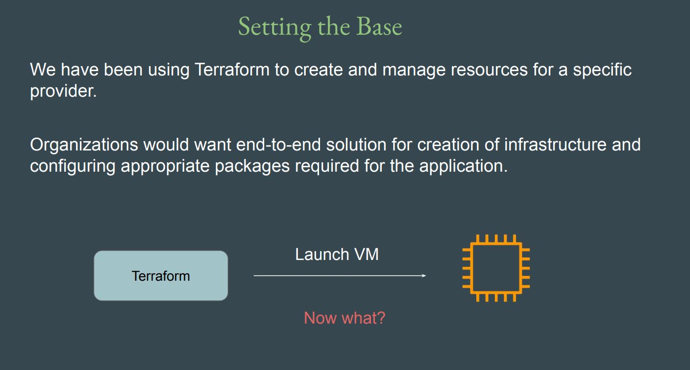
</p>

**They are generally used for:**

* **Bootstrapping:** Performing initial setup on newly created resources (e.g., installing software, configuring services).
* **Post-deployment configuration:** Customizing resources after they've been provisioned.
* **Cleanup operations:** Running commands before a resource is destroyed.

#### Types of Terraform Provisioners:

<p align="center">
  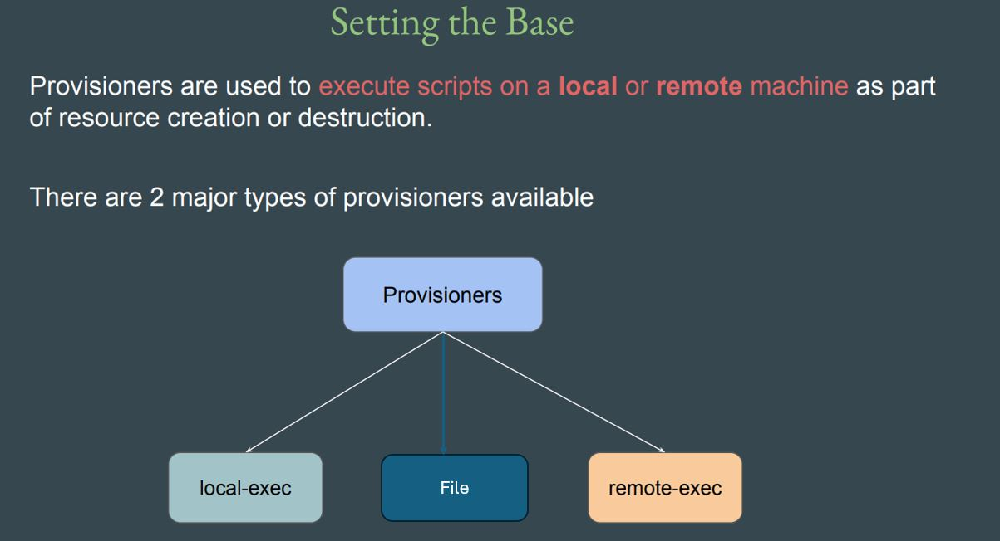
</p>

**There are three main types of built-in provisioners:**

#### 1. local-exec:

Executes a command on the machine running Terraform (your local machine or CI/CD runner).

<p align="center">
  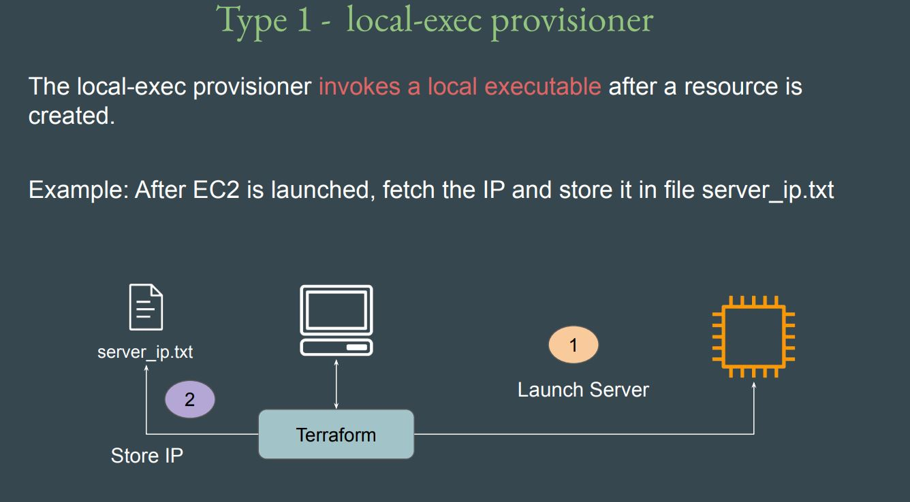
</p>

**Example:**
```
resource "aws_instance" "example" {
  ami           = "ami-0c55b159cbfafe1f0"
  instance_type = "t2.micro"

  provisioner "local-exec" {
    command = "echo Instance ${self.public_ip} created"
  }
}
```
#### 2. remote-exec:

Runs commands on the remote resource (e.g., a VM) using SSH or WinRM.

<p align="center">
  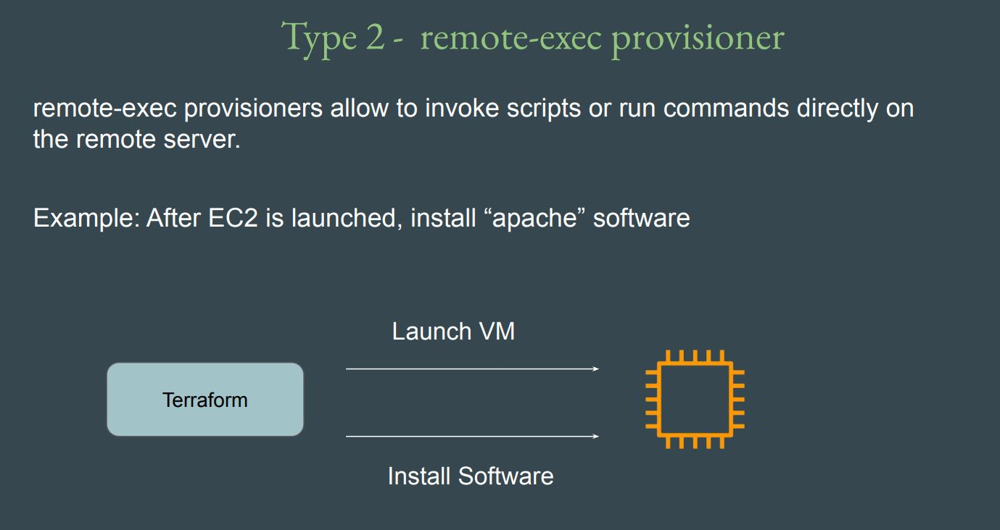
</p>

**Example:**
```
resource "aws_instance" "example" {
  ami           = "ami-0c55b159cbfafe1f0"
  instance_type = "t2.micro"

  connection {
    type        = "ssh"
    user        = "ec2-user"
    private_key = file("~/.ssh/id_rsa")
    host        = self.public_ip
  }

  provisioner "remote-exec" {
    inline = [
      "sudo yum update -y",
      "sudo yum install -y nginx"
    ]
  }
}

```

#### 3. file:

Uploads files from your local machine to the remote instance.

**Example:**
```
resource "aws_instance" "example" {
  ami           = "ami-0c55b159cbfafe1f0"
  instance_type = "t2.micro"
  key_name      = "my-ssh-key"

  connection {
    type        = "ssh"
    user        = "ec2-user"
    private_key = file("./my-ssh-key.pem")
    host        = self.public_ip
  }

  provisioner "file" {
    source      = "script.sh"
    destination = "/tmp/script.sh"
  }
}
```

#### Additonal provisioner Types:

* **Creation-Time Provisioner(default):** 

   Runs after the resource is created.

   <p align="center">
     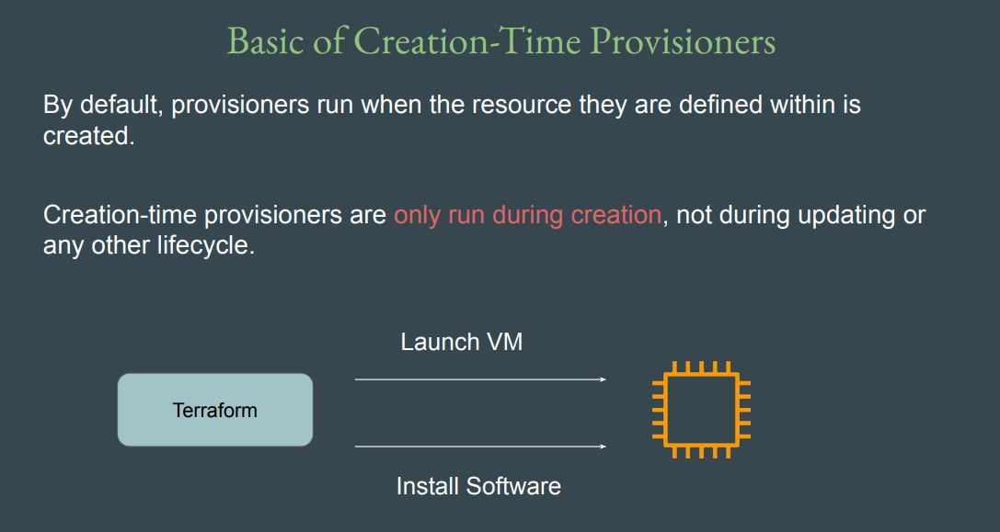
   </p>

* **Destroy:** (Destroy time provisioner)

  Runs when the resource is destroyed.
     <p align="center">
     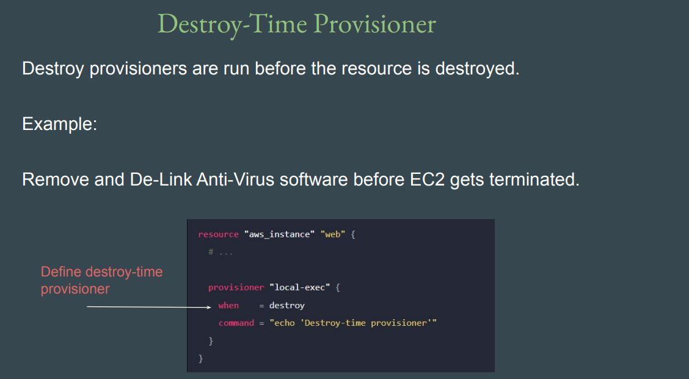
   </p>

  ```
  provisioner "local-exec" {
    when    = "destroy"
    command = "echo Instance is being destroyed"
  }
  ```

### Note: 

1. It is not necessary to define a aws_instance resource block for provisioner to run. They can be defined inside other resource types as well.
2. We can define multiple provisioners block in a single resource block.
   <p align="center">
     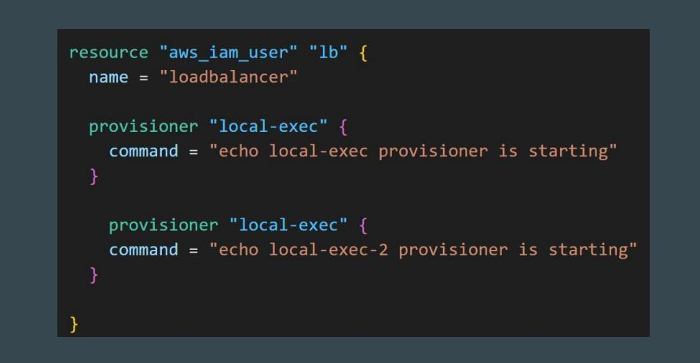
   </p>

### Failure Behaviour in Provisioners:

By default, provisioners that fail will also cause the terraform apply itself to fail. This will lead to resource being tainted and we have to re-create the resource.

<p align="center">
  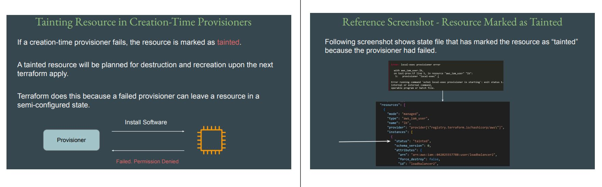
</p>

<p align="center">
  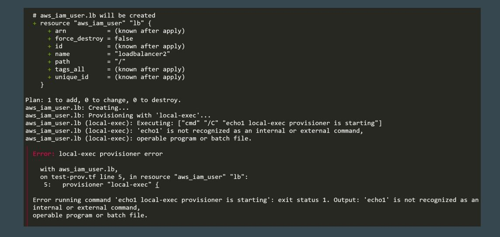
</p>

**The on_failure setting can be used to change the default behaviour.**

|Allowed Values|Description|
|-|-|
|continue|Ignore the error and continue with creation or destruction.|
|fail|Raise an error and stop applying (the default behavior). If this is a creation provisioner, taint the resource.|

<p align="center">
  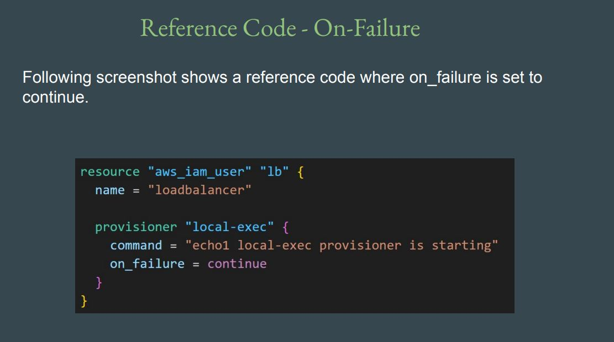
</p>

**Reference screenshot:**
<p align="center">
  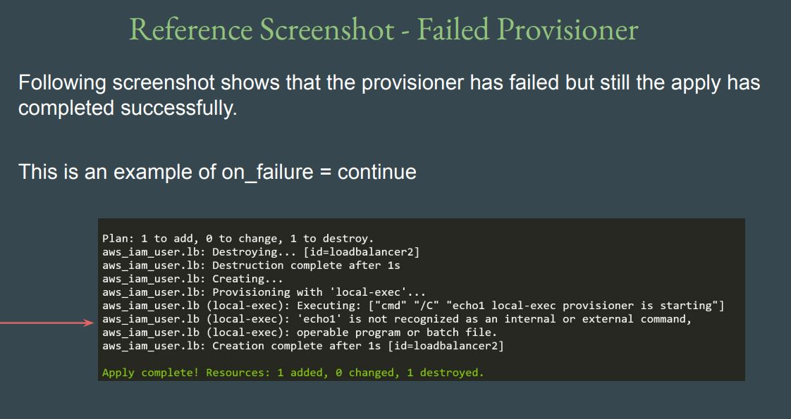
</p>

## Terraform Log-levels:

Terraform errors can be frustrating, especially when working with complex modules, remote backends, or dynamic blocks. But the good news? Terraform has built-in logging capabilities to help you troubleshoot like a pro.

Logging is the practice of collecting and storing data related to the events and actions taking place within a system or application. It is a crucial aspect of system monitoring and debugging, enabling visibility into the system's behavior and facilitating the identification of issues or errors that may arise.

### Why Enable Logging in Terraform?

<p align="center">
  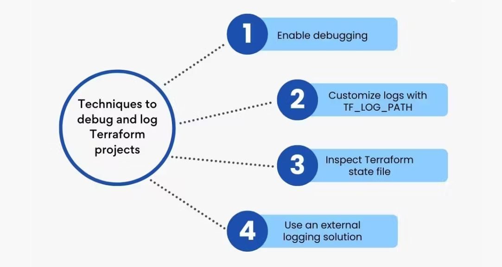
</p>

Terraform doesn’t log much by default — on purpose. It stays clean and quiet unless something goes wrong. But when you enable logging, you can cover:

* Backend connection issues
* API call failures
* Plan and apply internals
* Provider-related errors
* State inconsistencies

### Terraform Log Levels Explained:

|Level|Description|
|-|-|
|TRACE|One of the most descriptive log levels, if you set the log level to TRACE, Terraform will write every action and step into the log file.|
|DEBUG|A little bit more sophisticated logging which is used by developers at critical or more complex pieces of code to reduce debugging time.|
|INFO|The info log level is useful when needing to log some informative instructions or readme type instructions.|
|WARN|Used when something is not critical but would be nice to include in the form of a log so that the developer can make adjustments later.|
|ERROR|As the name suggests, this is used if something is terribly wrong and is a blocker.|

#### Enabling Terraform Logging:

Terraform uses the TF_LOG environment variable to set the desired log level.
```
export TF_LOG=INFO
```

You can also direct logs to a file:
```
#### For Linux/macOS (Bash/Zsh) ####
export TF_LOG=DEBUG
export TF_LOG_PATH=terraform.log
terraform plan

#### For Windows (Command Prompt) ####
set TF_LOG=TRACE
set TF_LOG_PATH=terraform.log # Optional: to save logs to a file
terraform plan

#### For Windows (PowerShell): ####
$env:TF_LOG="TRACE"
$env:TF_LOG_PATH="terraform.log" # Optional: to save logs to a file
terraform plan
```

**Note:** Always unset TF_LOG after you're done to avoid clutter:
```
unset TF_LOG TF_LOG_PATH
```


