# Terraform Meta-argumnets and Functions

## Resource Behavior and Meta-Argument:

**Understanding the Basics:**

A resource block declares that you want a particular infrastructure object to exist with the given settings.
```
resource "aws_instance" "myec2" {
   ami            = "ami-snjsdb238y8bhbv"
   instance_type  = "t2.micro"
}
```
**How Terraform Applies a Configuration:**

- reate resources that exist in the configuration but are not associated with a real infrastructure object in the state.
- Destroy resources that exist in the state but no longer exist in the configuration.
- Update in-place resources whose arguments have changed.
- Destroy and re-create resources whose arguments have changed but which cannot be updated in-place due to remote API limitations.

**Understanding the Limitations:**

What happens if we want to change the default behavior?

**Example:** Some modification happened in Real Infrastructure object that is not part of Terraform but you want to ignore those changes during terraform apply.

<p align="center">
  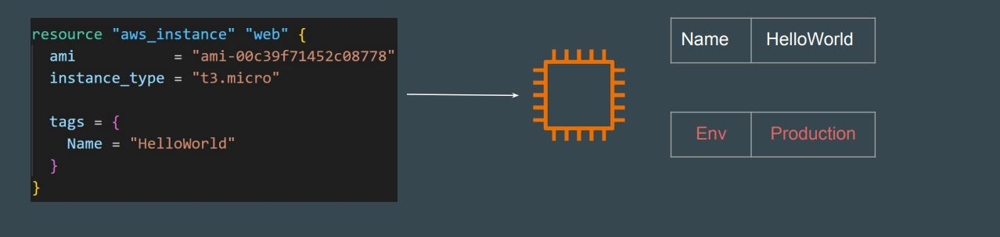
</p>

**Solution - Using Meta Arguments:**

Terraform allows us to include meta-argument within the resource block which allows some details of this standard resource behavior to be customized on a per-resource basis.

<p align="center">
  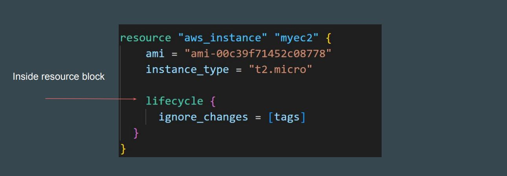
</p>

### Different Meta-Arguments:

|Meta-Argument|Description|
|-|-|
|lifecycle|Allows modification of the resource lifecycle.|
|depends_on|Handle hidden resource or module dependencies that Terraform cannot automatically infer.|
|count|Accepts a whole number, and creates that many instances of the resource|
|for_each|Accepts a map or a set of strings, and creates an instance for each item in that map or set.|
|provider|Specifies which provider configuration to use for a resource, overriding Terraform's default behavior of selecting one based on the resource type name|

## 1. Meta Argument - LifeCycle:

**Basics of Lifecycle Meta-Argument:**

Some details of the default resource behavior can be customized using the special nested lifecycle block within a resource block body:
```
resource "aws_instance" "myec2" {
   ami            = "ami-snjsdb238y8bhbv"
   instance_type  = "t2.micro"

   lifecycle {
      ignore_changes = [tags]
   #  ignore_changes = [tags, instance_type, ami]
   }
}
```

**Arguments Available:**

There are four argument available within lifecycle block:

|Arguments|Description|
|-|-|
|create_before_destroy|New replacement object is created first, and the prior object is destroyed after the replacement is created.|
|prevent_destroy|Terraform to reject with an error any plan that would destroy the infrastructure object associated with the resource|
|ignore_changes|Ignore certain changes to the live resource that does not match the configuration.|
|replace_triggered_by|Replaces the resource when any of the referenced items change |

**1. Replace Triggered By:**
  
Replaces the resource when any of the referenced items change.

<p align="center">
  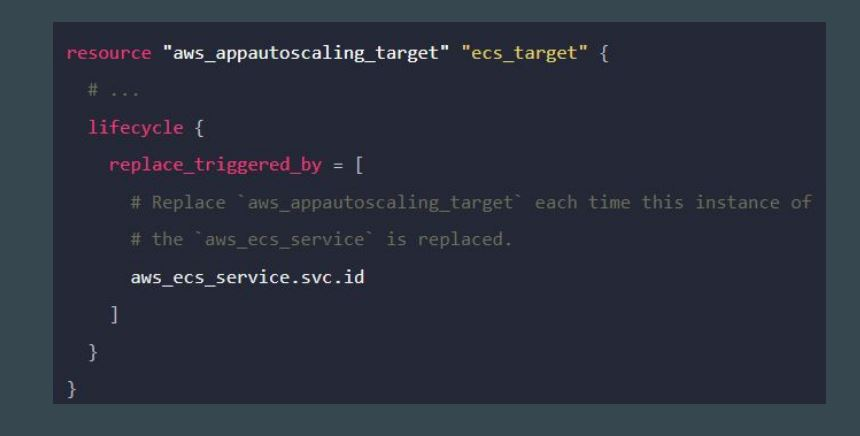
</p>

**2. Create Before Destroy:**

Understanding the Default Behavior:

By default, when Terraform must change a resource argument that cannot be updated in-place due to remote API limitations, Terraform will instead destroy the existing object and then create a new replacement object with the new configured arguments.

<p align="center">
  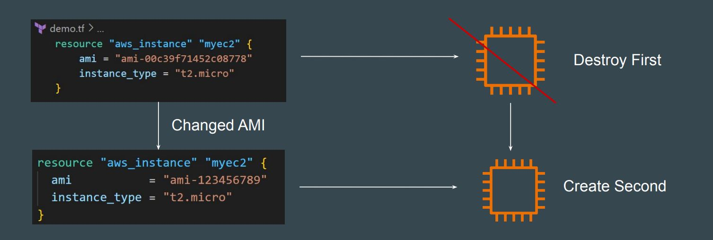
</p>

The create_before_destroy meta-argument changes this behavior so that the new replacement object is created first, and the prior object is destroyed after the replacement is created.

<p align="center">
  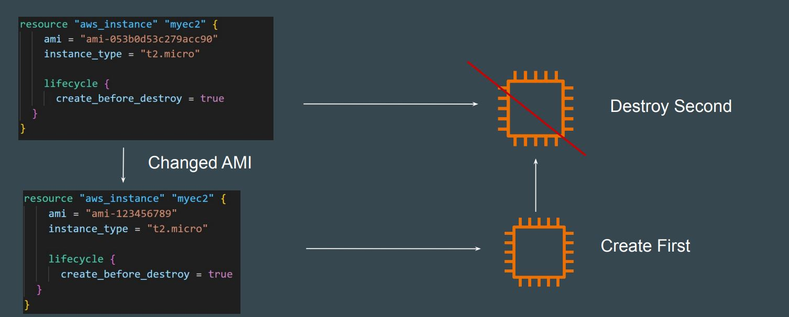
</p>

**3. Prevent Destroy:**

This meta-argument, when set to true, will cause Terraform to reject with an error any plan that would destroy the infrastructure object associated with the resource, as long as the argument remains present in the configuration.

```
resource "aws_instance" "myec2" {
   ami            = "ami-snjsdb238y8bhbv"
   instance_type  = "t2.micro"

   lifecycle {
      prevent_destroy =  true
   }
}
```
#### Note:

* This can be used as a measure of safety against the accidental replacement of objects that may be costly to reproduce, such as database instances.
* Since this argument must be present in configuration for the protection to apply, note that this setting does not prevent the remote object from being destroyed if the resource block were removed from configuration entirely.

**4. Ignore Changes:**

In cases where settings of a remote object is modified by processes outside of Terraform, the Terraform would attempt to "fix" on the next run.

In order to change this behavior and ignore the manually applied change, we can make use of ignore_changes argument under lifecycle.

```
resource "aws_instance" "myec2" {
   ami            = "ami-snjsdb238y8bhbv"
   instance_type  = "t2.micro"

   lifecycle {
      ignore_changes = [tags]
   #  ignore_changes = [tags, instance_type, ami]
   }
}
```
#### Note:

Instead of a list, the special keyword all may be used to instruct Terraform to ignore all attributes, which means that Terraform can create and destroy the remote object but will never propose updates to it.

```
resource "aws_instance" "myec2" {
   ami            = "ami-snjsdb238y8bhbv"
   instance_type  = "t2.micro"

   lifecycle {
      ignore_changes = all
   }
}
```

## 2. Meta Argument - depends_on:

Understanding the Challenge:

In a scenario where resources are defined independently, there is no guaranteed order stating which resource will be created first. Sometimes the EC2 instance may be created first, and sometimes the S3 bucket may be created first.

```
resource "aws_instance" "myec2" {
   ami            = "ami-snjsdb238y8bhbv"
   instance_type  = "t2.micro"
}

resource "aws_s3_bucket" "example" {
  bucket  = "demo-bucket"
}
```

The depends_on meta-argument instructs Terraform to complete all actions on the dependency object before performing actions on the object declaring the dependency.

<p align="center">
  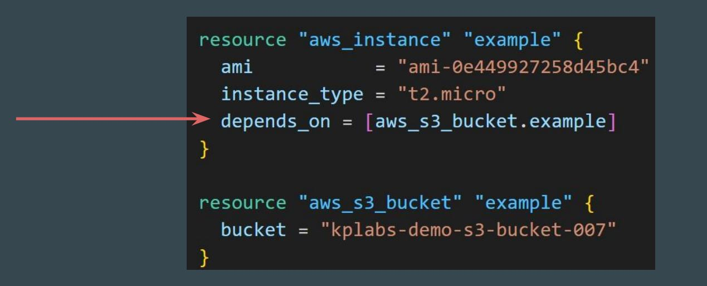
</p>

**Order of Creation:**

The depends_on meta-argument explicitly tells Terraform that the aws_instance.example must be created after aws_s3_bucket.example.

<p align="center">
  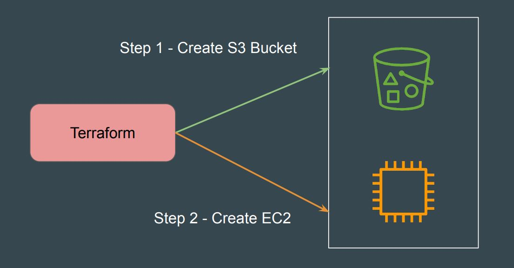
</p>

**Order of Deletion:**

When you run terraform destroy, the order is reversed to ensure dependencies are not broken during deletion.

<p align="center">
  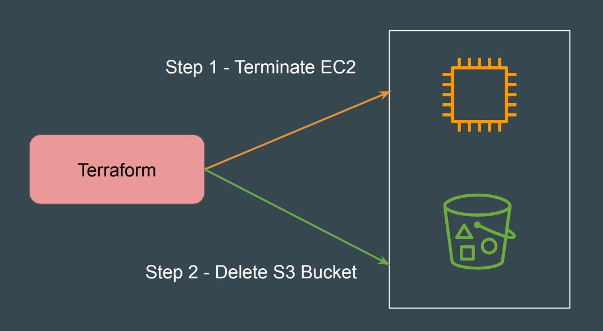
</p>

#### Implicit vs Explicit Dependencies:

There are two ways to define dependencies in Terraform.
<p align="center">
  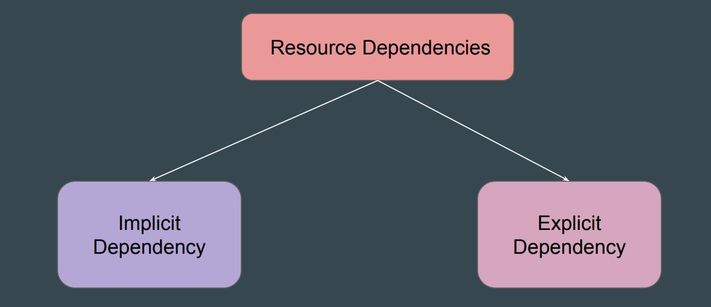
</p>

**Explicit Dependency:**

Explicit dependencies are declared using the depends_on meta-argument. 

You use this when there’s no direct attribute reference, but you still need to control the order of resource creation.

```
resource "aws_instance" "myec2" {
   ami            = "ami-snjsdb238y8bhbv"
   instance_type  = "t2.micro"
   depends_on     = [aws_s3_bucket.example"]
}

resource "aws_s3_bucket" "example" {
  bucket  = "demo-bucket"
}
```

**Implicit Dependency:**

**Requirement:** EC2 instance should only allow communication from trusted set of IP addresses.

Resources Needed: EC2 Instance + Security Group (Firewall)

Since in aws_instance resource there is a reference to the ID of the aws_security_group resource, Terraform automatically understands that the security group must be created before the EC2 instance

<p align="center">
  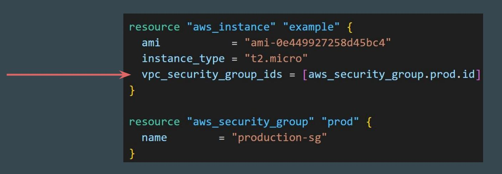
</p>

**Final Revision:**

<p align="center">
  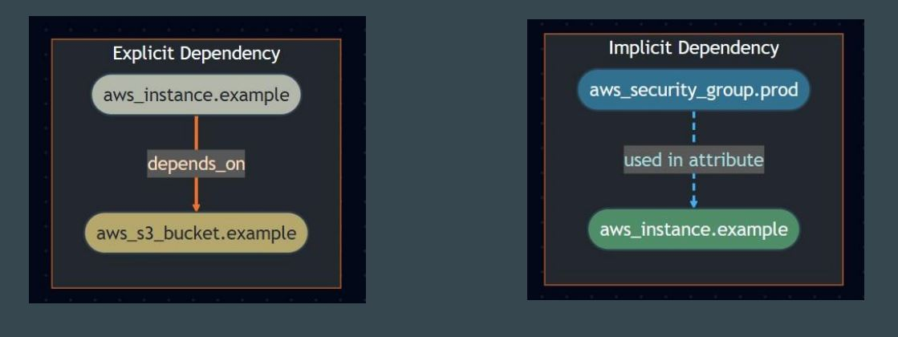
</p>

## 3. Meta Argument - Count:

**Understanding the Challenge:**
By default, a resource block configures one real infrastructure object.

<p align="center">
  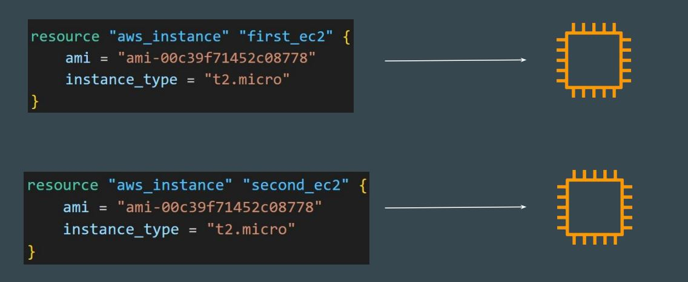
</p>

**Use-Case:**

<p align="center">
  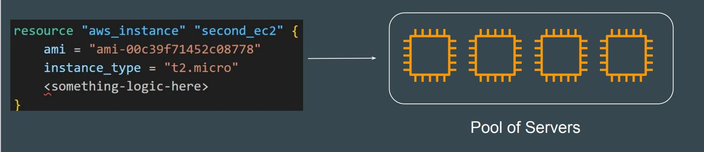
</p>

The count argument accepts a whole number, and creates that many instances of the resource.

<p align="center">
  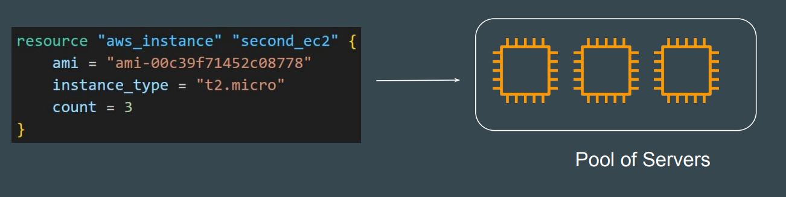
</p>

**Challenges with Count:**

The instances created through count and identical copies, but you might want to customize certain properties for each one.

<p align="center">
  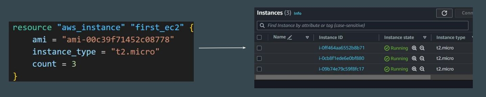
</p>

For many resources, exact identical copies are not required and will not work.

Example: You cannot have multiple AWS Users with exact same name.

<p align="center">
  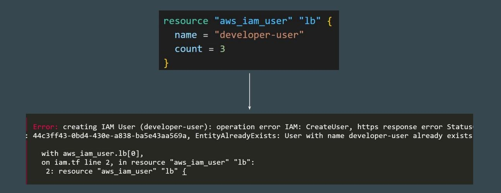
</p>

**Introducing Count Index:**

When using count, you can also make use of count.index which allows better flexibility.

This attribute holds a distinct index number, starting from 0, that uniquely identifies each instance created by the count meta-argument.

<p align="center">
  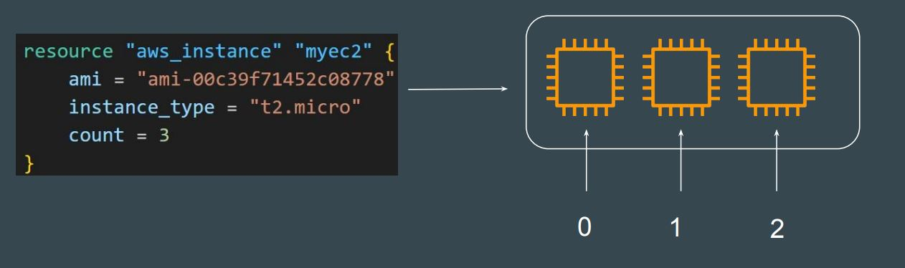
</p>

**Tabular Representation:**

Following representation shows each EC2 instance’s resource address that contains the index.

<p align="center">
  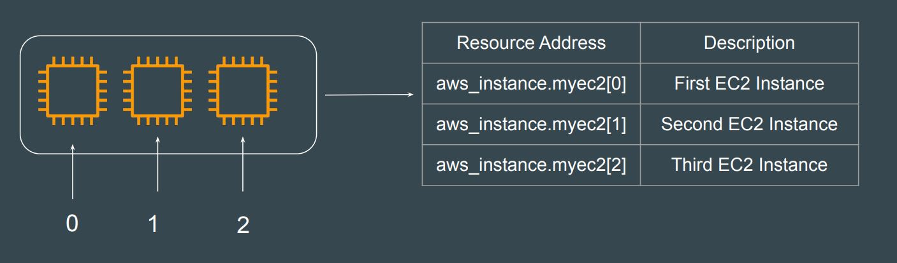
</p>

<p align="center">
  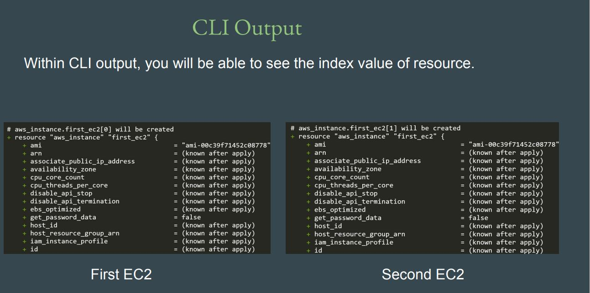
</p>

<p align="center">
  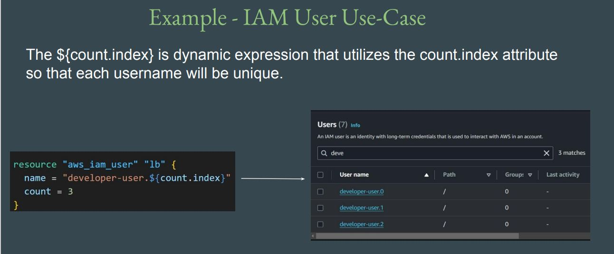
</p>

**Enhancing with Count Index:**

You can use count.index to iterate through the list to have more customization.

<p align="center">
  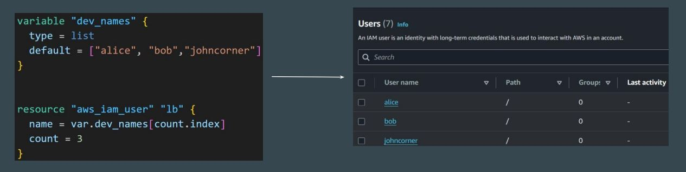
</p>

## 4. Meta Argument - for_each:

By default, a resource block configures one real infrastructure object. However, sometimes you want to manage several similar objects (like a fixed pool of compute instances) without writing a separate block for each one. Terraform has two ways to do this: **count** and **for_each**.

```
resource "aws_iam_user" "lb" {
  name = "alice"
}
```
**Requirement:** If we want to create multiple resources with different configuration, we have to add multiple different resource blocks.
```
resource "aws_iam_user" "lb" {
  name = "alice"
}
resource "aws_iam_user" "lb" {
  name = "bob"
}
resource "aws_iam_user" "lb" {
  name = "john"
}
resource "aws_iam_user" "lb" {
  name = "james"
}
resource "aws_iam_user" "lb" {
  name = "will"
}
```

If a resource block includes a for_each meta argument whose value is a map or a set of strings, Terraform creates one instance for each member of that map or set.

<p align="center">
  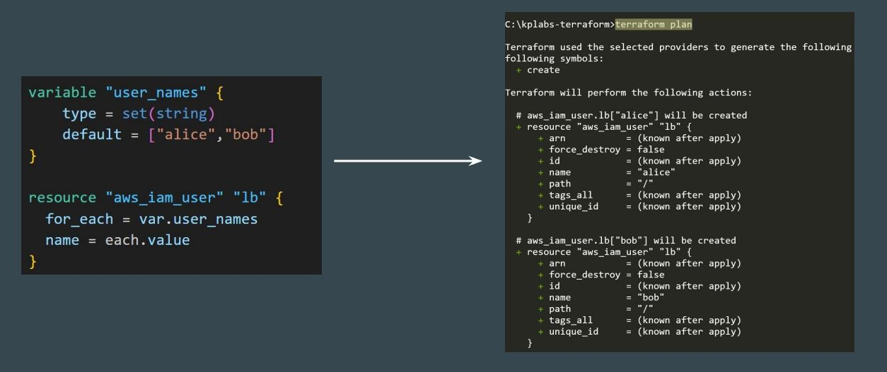
</p>

**Note:** In blocks where for_each is set, an additional each object is available. 

These object has two attributes:

|Each Object| Description|
|-|-|
|each.key|The map key (or set member) corresponding to this instance.|
|each.value |The map value corresponding to this instance|

**Example - for_each with Map:**

When for_each is used with map, we can make use of each object to extract both key and value from the given map.

```
variable "mymap" {
  default = {
    dev		= "ami-123"
	prod	= "ami-456"
  }
}

resource "aws_instance" "web" {
  for_each		= var.mymap
  ami			= each.value
  instance_type	= "t3.micro"
  
  tags = {
    Name = each.key
  }
}
```

## Terraform Conditional expression:


