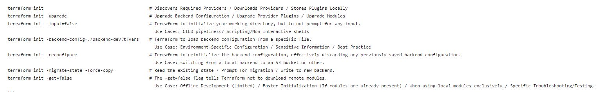

#### Terraform Basic Commands ####

<p align="center">
  
</p>

```
terraform init                                         # Discovers Required Providers / Downloads Providers / Stores Plugins Locally
terraform init -upgrade                                # Upgrade Backend Configuration / Upgrade Provider Plugins / Upgrade Modules
terraform init -input=false                            # Terraform to initialize your working directory, but to not prompt for any input.
                                                         Use Cases: CICD pipeliness/ Scripting/Non Interactive shells
terraform init -backend-config=./backend-dev.tfvars    # Terraform to load backend configuration from a specific file.
                                                         Use Case: Environment-Specific Configuration / Sensitive Information / Best Practice
terraform init -reconfigure                            # Terraform to reinitialize the backend configuration, effectively discarding any previously saved backend configuration.
                                                         Use Case: switching from a local backend to an S3 bucket or other.
terraform init -migrate-state -force-copy              # Read the existing state / Prompt for migration / Write to new backend.
terraform init -get=false                              # The -get=false flag tells Terraform not to download remote modules.
                                                         Use Case: Offline Development (Limited) / Faster Initialization (If modules are already present) / When using local modules exclusively / Specific Troubleshooting/Testing.
```
